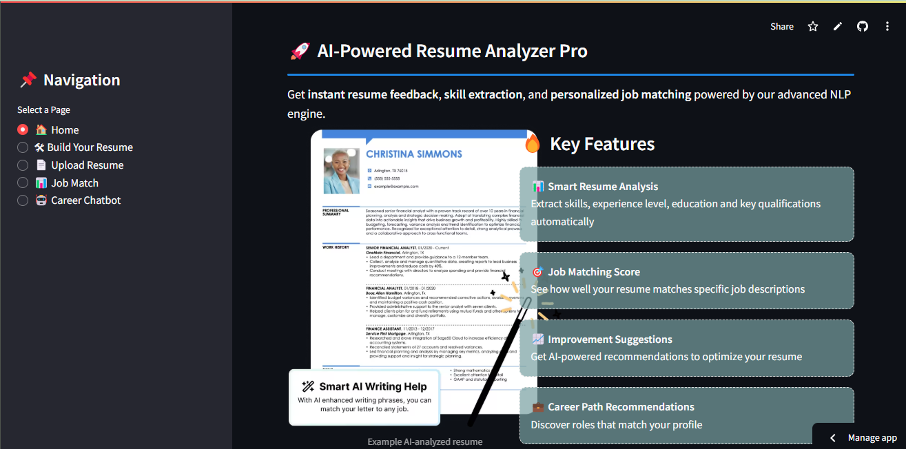
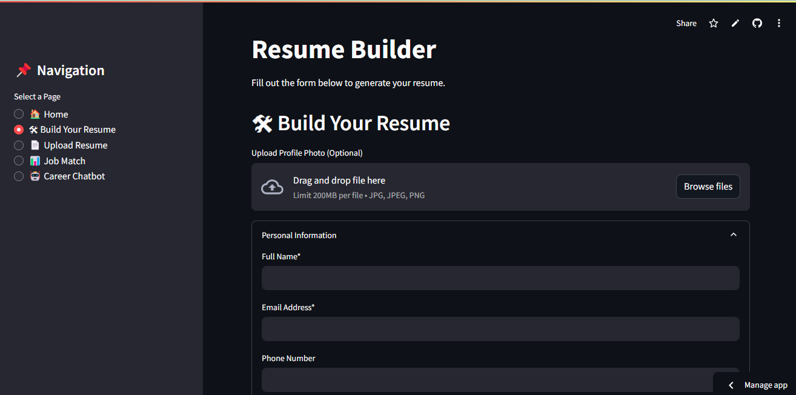
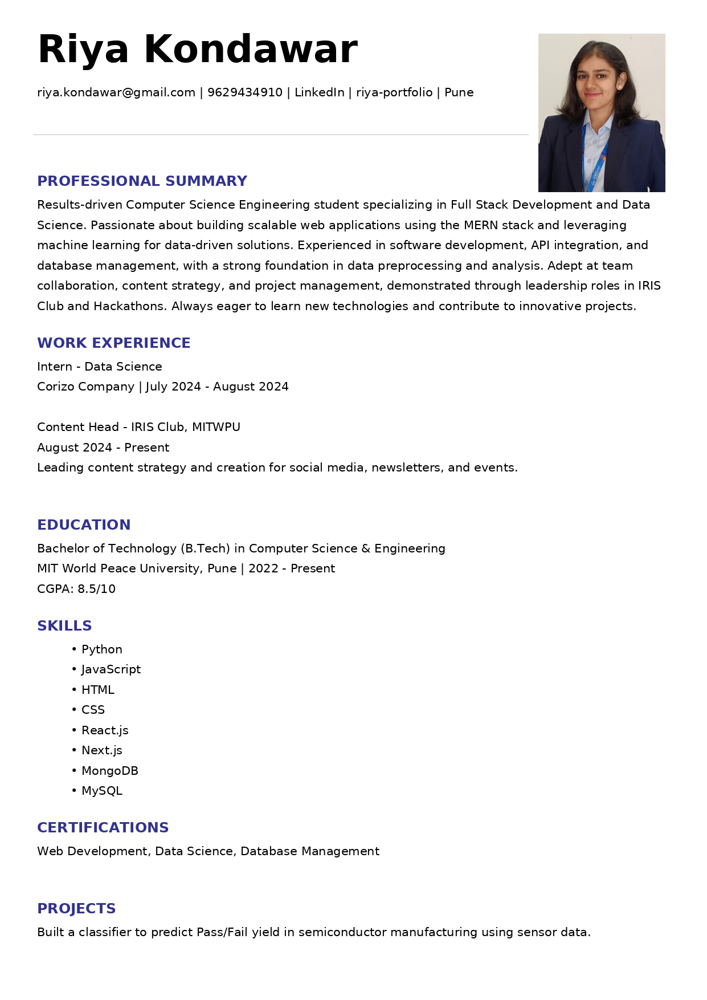
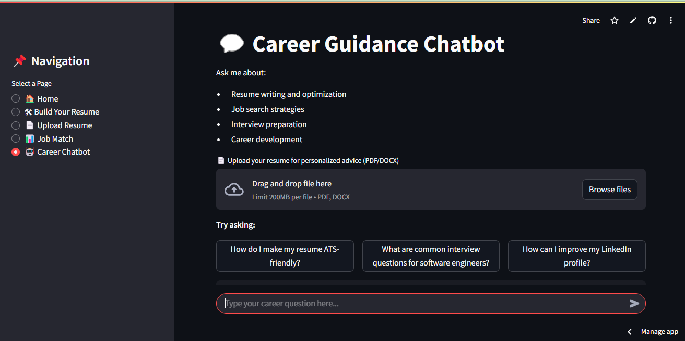

# 📄 SmartResume Pro

[](https://riya-resume-builder.streamlit.app/)

> SmartResume Pro is an AI-powered resume builder and analyzer with an integrated chatbot for user assistance. It offers resume parsing, skill extraction, ATS compatibility checks, and automated PDF generation.

---

## 📸 Screenshots

  
  
  


---

## ✨ Key Features

- 🚀 **Smart Builder**: Create ATS-optimized resumes from templates  
- 🧠 **Resume Analysis**: Extract skills, experience, and education using NLP  
- 🧾 **Job Matching**: Match resumes with job descriptions  
- 💬 **AI Chatbot**: Get personalized career advice  

---

## **1️⃣ Resume Builder**
- Users input personal, educational, and professional details.
- Select from multiple professional resume templates.
- Generates an **ATS-friendly resume** with a calculated **ATS Score**.
- Allows users to download the generated resume in **PDF/DOCX format**.

## **2️⃣ Resume Upload & Analyzer**
- Users can **upload** an existing resume (PDF/DOCX).
- System extracts content using **PDF parsing**.
- Uses NLP techniques to:
  - **Parse key sections**: Name, contact details, experience, education, skills, projects, etc.
  - **Identify key skills** from the resume.
  - **Suggest relevant courses & learning resources** to improve skills.

## **3️⃣ Resume Analysis w.r.t Job Description (JD)**
- User uploads a **job description**.
- NLP model compares **resume skills vs. job requirements**.
- Provides:
  - **Match percentage** between resume & JD.
  - **Missing skills & keywords** that should be added.
  - **Suggested modifications** to improve resume for the specific job.

---

## 🛠️ Quick Start

```bash
git clone https://github.com/riya-kondawar/Resume-builder-analyzer-NLP.git
cd Resume-builder-analyzer-NLP
python -m venv venv
.\venv\Scripts\activate
pip install -r requirements.txt
streamlit run app.py
```

---

## 📚 Documentation

📄 View full project report: [Report.docx](./assets/ReportFile-NLP.docx) 

---

## 🌟 Alternative refereences

- [Novoresume](https://novoresume.com)  
- [Zety](https://zety.com)  
- [ResumeNow](https://www.resumenow.com)

---

## 🧰 Built With

- **Python** 🐍  
- **Streamlit** ⚡  
- **Gemini AI** 🤖

---

## 👩‍💻 Author

Made with ❤️ by [**Riya Kondawar**](https://github.com/riya-kondawar)
